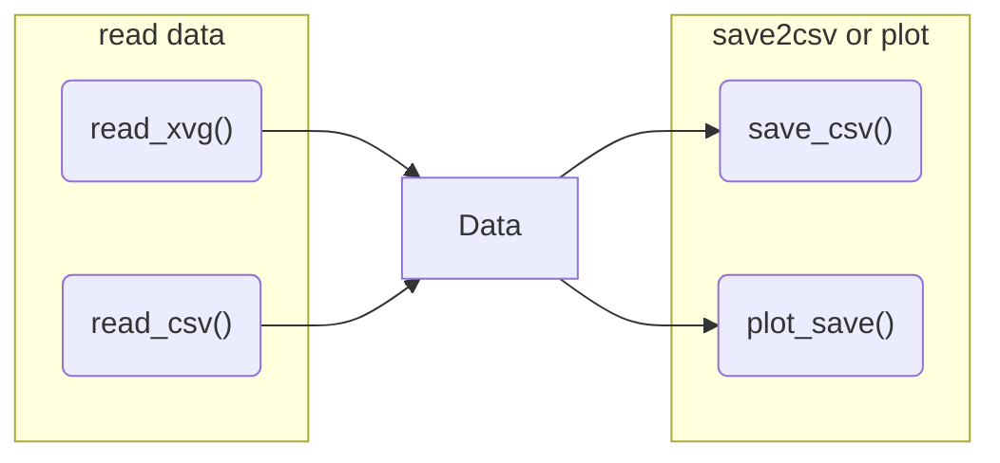

# Task4 - 命令行参数的解析

## 任务要求

很多时候我们会需要从命令行启动脚本，并赋给相关的参数以实现不同的功能，比如读入不同的文件，生成不同的文件等等。

此任务要求整合Task2和Task3的代码，编程实现如下功能：

1. 能从xvg文件中读入数据并保存到列表
2. 能从csv文件中读入数据并保存到列表
3. 能从列表中将数据保存到csv文件
4. 能将列表中的数据绘制成折线图并保存图片
5. 实现解析命令行参数，至少包含以下两个命令行参数：
   1. `-f`输入文件名：rmsd.xvg或rmsd.csv
   2. `-o`输出文件名：rmsd.csv或rmsd_plot.png
6. 模块化设计，每个函数实现一定的功能，比如可以包含如下函数：
   1. read_xvg()
   2. read_csv()
   3. save_csv()
   4. plot_save()



比较推荐的命令行参数方式：

```bash
your_code.py -f InputFile -o OutputFile
```

当然如下的赋值方式也可以接受：

```bash
your_code.py InputFile OutputFile
```

实现命令行参数解析的工具有很多，比如你可以直接使用sys模块，或者使用较为推荐的**argparse**等第三方库。


## 任务检查

将相关的文件和代码push到你的远程仓库，戳我链接就行。